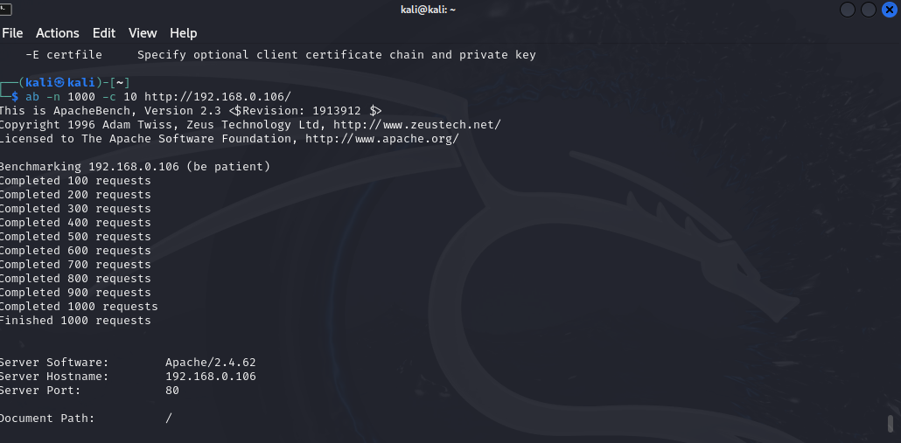
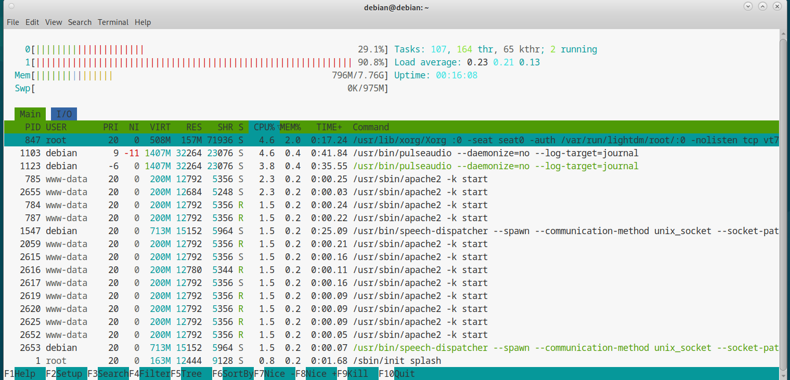

Se realizo una prueba de simulacion de trafico en el sitio web de Wordpress configurado en la maquina virtual Debian

Para la prueba se necesito dos maquinas virtuales:
1. Kali linux: atacante
2. Debian: Servidor web

Procedimiento:

1. Se verifica que ambas maquinas pertenezcan a la misma red y tengan conexion entre si.
2. Se procede a instalar Apache Benchmark para hacer pruebas de generacion de trafico en la maquina Kali linux.
3. Se ejecuta el comando `ab -n 1000 -c 10 http://<IP_debian>/` para generar trafico
4. Se instala la herramienta `htop` para monitorear el servidor web.
5. Se ejecuta para monitorear los procesos y recursos del servidor web

6. Se ejecuta el comando `ab -n 5000 -c 200 http://<IP_debian>/ > report_ab.txt` para generar trafico y los resultados almacenarlo en el archivo de texto. 
	==*Para las pruebas se ejecuto el comando `ab -n 15000 -c 200 http://192.168.0.106/ > report_ab_second.txt` ya que la maquina virtual de prueba tiene recursos altos, y para que los valores en los tests sean consecuentos a lo que se requiere*==
7. En la ejecucion de prueba se obtuvo este resultado en la herramienta de monitoreo `htop`
   
